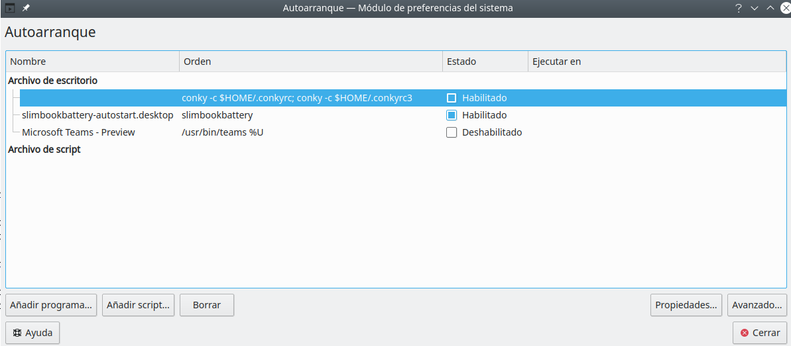

CONKY configurations SLIMBOOK
==========================

These two files contain the conky configurations for my SLIMBOOK laptop

Installation
-----------------

```bash
cp conkyrc $HOME/.conkyrc
cp conkyrc3 $HOME/.conkyrc3
```


To run these conky configurations at startup in KDE environment:

Alt+F2 --> Autoarranque or autostart

<p align="center">
    
</p>


